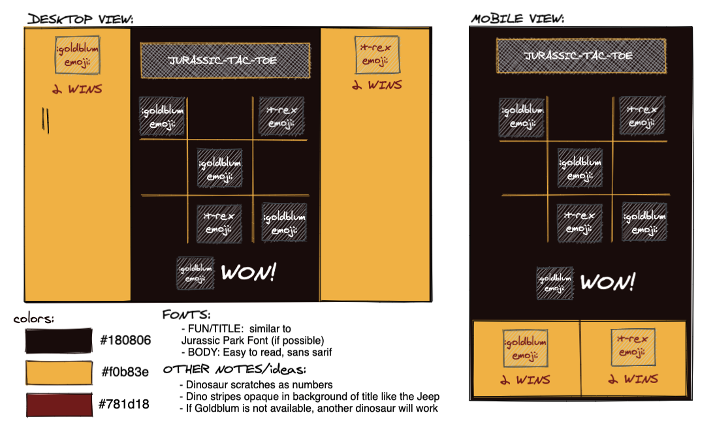

# Jurassic-Tac-Toe

### Developers
- [Kristi Miller](https://github.com/Kristiannmiller)

### Project Manager
- [Hannah Hudson](https://github.com/hannahhch)

### Project Links
- [Repo](https://github.com/Kristiannmiller/km-tic-tac-toe)

## Set-up
- Fork the repo and clone down into terminal
- Open in text editor
- In terminal, run command "open index.html" to interact with app.

## Overview & Learning Goals
For my Mod 1 solo final project, I will build an application using css and html framework and make it functional using JavaScript. The application design and functionality will be based on a [provided comp](https://frontend.turing.io/projects/module-1/tic-tac-toe-solo.html).

I will use all the tools I have acquired in Mod 1 to accomplish the completion of this project. I will also challenge myself to discover new ways to use JavaScript to update the DOM and data model. I will challenge myself to logically think through any issues that come up and attempt to use my knowledge to solve those issues so as to not rely on outside sources.

## Progression

7/30: Gave day one deliverables to instructors and reviewed the project scope. Created a GitHub Project boards planning out the steps of the project I would like to accomplish each day.

7/31: Found and edited image assets for player tokens, finalized HTML framework.

8/1: Added CSS styling to resemble wireframe idea. Plan to revisit CSS once functionality is finished. Added basic class syntax, properties, and methods to Game.js and Player.js files as outlined in rubric. Linked all .js files to index.html.

8/2:
8/3:
8/4: Project due at 9:00pm

## Showcase

Wireframe 
  

Desktop View 
  

Mobile View 
  

Functionality 
  

Project spec & rubric can be found [here](https://frontend.turing.io/projects/module-1/tic-tac-toe-solo.html)
